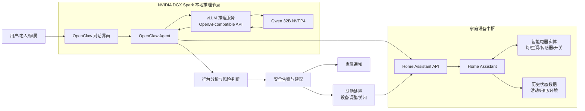

# SparkGuardian 系统架构图

## 数据流说明

1. 用户通过 OpenClaw 发起自然语言请求（控制或查询）。  
2. OpenClaw Agent 调用本地 Qwen 32B NVFP4（经 vLLM）进行意图理解与决策。  
3. Agent 通过 Home Assistant API 执行设备控制、读取实时与历史状态。  
4. 行为分析模块结合历史数据输出风险等级、解释依据和处置建议。  
5. 系统执行联动动作，并向用户/家属返回结果与提醒。

## 架构价值

- 本地推理：核心家庭数据不依赖云端大模型。
- 可解释闭环：从“查询/控制”扩展到“分析/预警/处置”。
- 场景导向：面向独居老人安全，兼顾实用性与可落地性。
